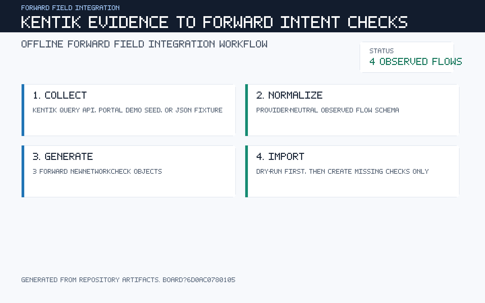
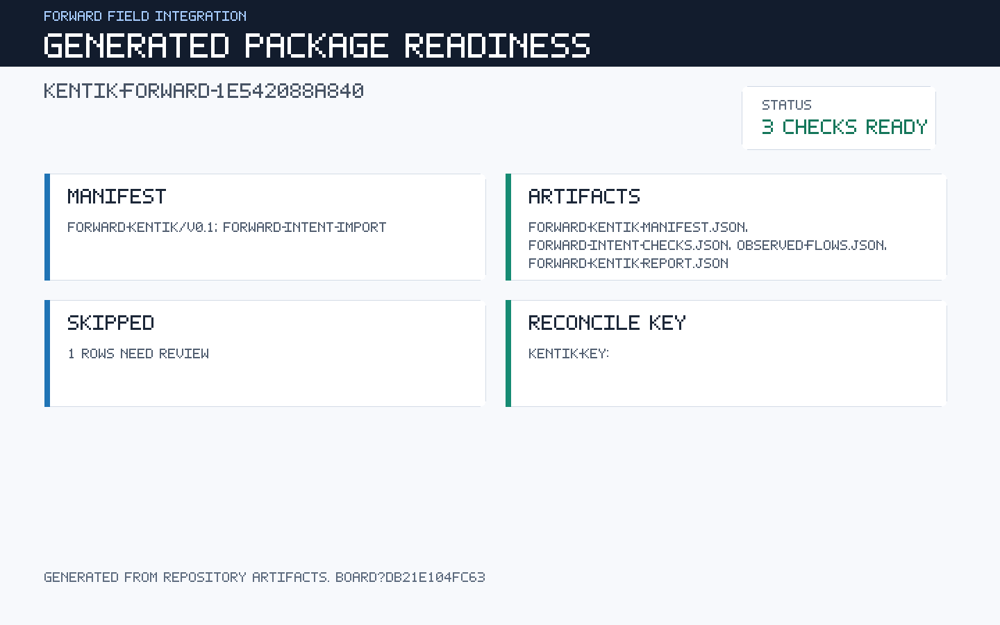
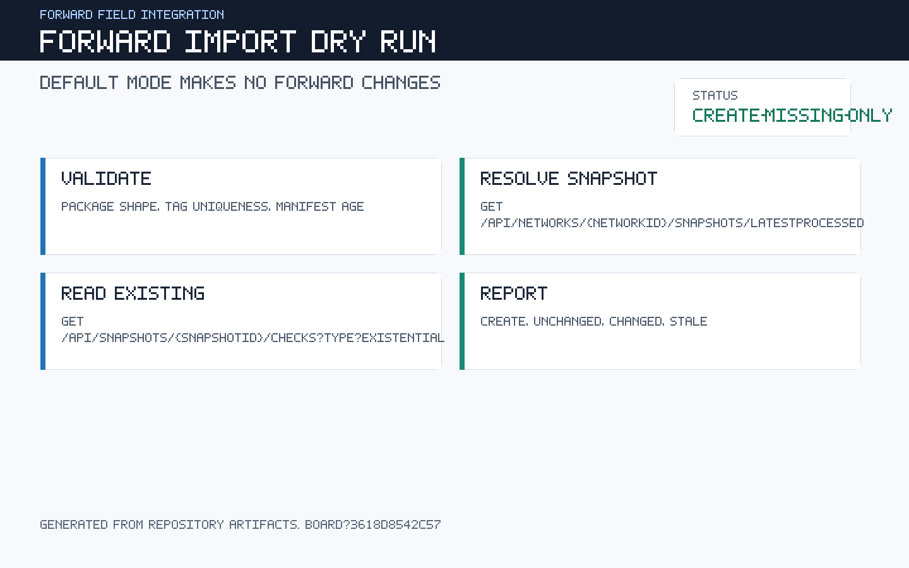
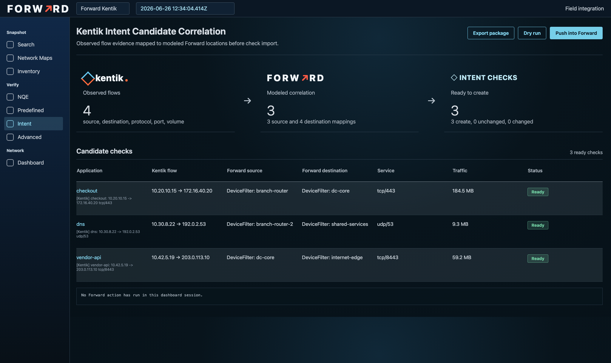
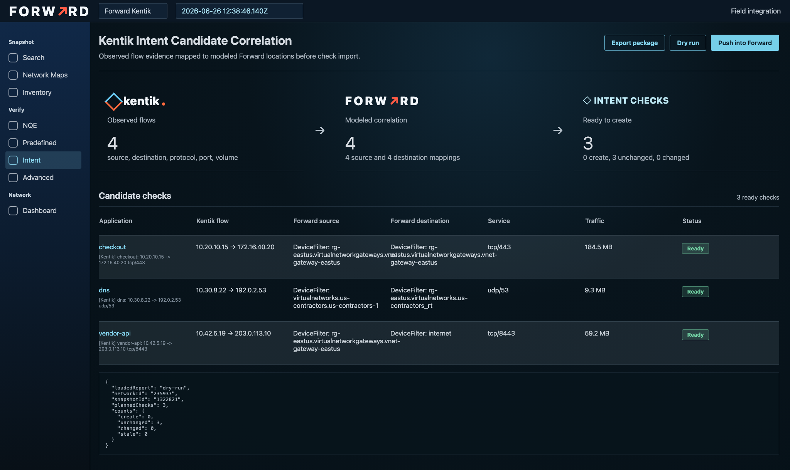

# Forward Kentik

[](https://github.com/forwardnetworks/forward-kentik/actions/workflows/ci.yml)

Forward field integration for turning Kentik flow evidence into Forward
intent-check import packages.

This repository is a field integration, not an officially supported Forward
product integration. It is intended for repeatable customer demos, presales
validation, and integration prototyping.

The presales problem: Forward intent checks demo well, but building the first
set of checks is hard. Kentik already has observed source, destination,
protocol, port, and volume evidence. This repo turns that evidence into
reviewable candidate Forward checks.

## MVP Scope

- Generate candidate Forward intent checks from Kentik flow evidence.
- Show the correlation between Kentik evidence and modeled Forward locations.
- Export a package for review.
- Dry-run/reconcile against a Forward snapshot.
- Push missing checks only after explicit operator action.

Scheduling is intentionally out of scope for the MVP. The first production-grade
workflow is explicit review, export, dry-run, then push.

## Shape

- Kentik live API smoke: `scripts/kentik-live-smoke.mjs`
- Kentik portal demo seed: `scripts/seed-kentik-demo-data.mjs`
- Offline export workflow: `scripts/kentik-export.mjs`
- Exposure-style dashboard: `scripts/build-dashboard.mjs`, `scripts/serve-dashboard.mjs`
- Forward create-missing-only importer: `scripts/forward-import-package.mjs`
- Forward device map template: `scripts/forward-location-map-template.mjs`
- Normalized flow model: `src/normalize.mjs`
- Forward package generation: `src/forward-package.mjs`
- Forward location mapping: `src/location-map.mjs`
- Kentik API client/config: `src/kentik-client.mjs`, `src/config.mjs`
- Demo fixture: `fixtures/kentik-topxdata.demo.json`
- Harness smoke: `scripts/workflow-smoke.mjs`

## Current Flow

1. Read Kentik Query API `topXdata` JSON from a live call or fixture.
2. Normalize vendor fields into observed flow rows.
3. Map Kentik endpoints to modeled Forward locations when a map exists.
4. Drop rows that cannot safely become path checks.
5. Generate Forward-native `NewNetworkCheck[]` JSON.
6. Generate a manifest and summary report for operator review.
7. Import selected checks into Forward with a dry-run-first offline workflow.

Default output goes to `dist/`:

- `observed-flows.json`
- `forward-intent-checks.json`
- `forward-kentik-manifest.json`
- `forward-kentik-report.json`

## Screenshots

Workflow overview:



Package readiness:



Forward import dry run:



Exposure-style dashboard:



After Forward reconciliation:



## Forward Import

The primary integration path is offline:

```bash
npm run kentik:export -- --input fixtures/kentik-topxdata.demo.json

export FORWARD_BASE_URL=https://forward.example.com
export FORWARD_USER=<user>
export FORWARD_PASSWORD=<password-or-token>
export FORWARD_NETWORK_ID=<network-id>

npm run forward:import -- --checks dist/forward-intent-checks.json --manifest dist/forward-kentik-manifest.json
npm run forward:import -- --checks dist/forward-intent-checks.json --manifest dist/forward-kentik-manifest.json --apply
```

The importer validates package shape, resolves the latest processed snapshot,
reads existing checks, reconciles by `kentik-key:*`, and creates only missing
checks when `--apply` is present.

`--apply` also preflights generated Forward locations before posting. Host
locations are checked against `/api/networks/{networkId}/hosts/{hostSpecifier}`.
Device locations are checked against `/api/networks/{networkId}/devices`. This
prevents the common demo failure where observed Kentik IPs are not modeled in
the target snapshot. In that case, keep the package as a review artifact, adjust
the source/destination mapping, or run against a network where the endpoints
exist.

Use `--location-map` when raw Kentik endpoints need to be correlated to modeled
Forward devices or interfaces:

```bash
npm run kentik:export -- \
  --input fixtures/kentik-topxdata.demo.json \
  --location-map docs/examples/location-map.demo.json
```

To build a customer-specific starting point from a target Forward network:

```bash
export FORWARD_BASE_URL=https://forward.example.com
export FORWARD_USER=<user>
export FORWARD_PASSWORD=<password-or-token>
export FORWARD_NETWORK_ID=<network-id>

npm run kentik:export
npm run forward:location-map -- --flows dist/observed-flows.json --out dist/forward-location-map.template.json
npm run kentik:export -- --location-map dist/forward-location-map.template.json
npm run dashboard:build
```

The generated map is marked `reviewRequired: true`; it is a template, not a
claim that every flow has the right business intent.

The dashboard can load a reconciliation report:

```bash
npm run forward:import -- --checks dist/forward-intent-checks.json --manifest dist/forward-kentik-manifest.json --report dist/forward-import-dry-run-report.json
npm run dashboard:build -- --import-report dist/forward-import-dry-run-report.json
```

Forward Data Connector config generation is optional and only useful when you
want `observed-flows.json` visible to NQE. Data Connectors do not create intent
checks, so they are not the main workflow.

## Commands

```bash
npm run kentik:export
npm run forward:location-map
npm run dashboard:build
npm run dashboard:serve
npm run kentik:seed:demo
npm run forward:import -- --validate-only --checks dist/forward-intent-checks.json --manifest dist/forward-kentik-manifest.json
npm run screenshots:render
npm test
npm run workflow:smoke
npm run repo:validate
npm run ci
```

## Quality Bar

This repository is public. Do not commit customer data, Kentik tokens, Forward
credentials, or live flow exports. The default gates are:

- `npm run repo:validate`
- `npm run kentik:export`
- `npm run screenshots:render`
- `npm test`
- `npm run workflow:smoke`
- `npm run forward:import:smoke`

See [docs/field-integration-guidelines.md](docs/field-integration-guidelines.md)
for branding and support boundaries.

See [docs/operator-runbook.md](docs/operator-runbook.md) for the field workflow
from export through post-apply reconciliation.

Live Kentik smoke requires both the local token and Kentik email:

```bash
export KENTIK_EMAIL=<user@domain.example>
export KENTIK_TOKEN_FILE=~/kentik.token
npm run kentik:live:smoke -- --query docs/examples/top-flows-query.json --out fixtures/live-topxdata.json
npm run kentik:export -- --input fixtures/live-topxdata.json
```

The current trial/demo tenant exposes portal dashboard templates, but no
configured devices or sites. Seed demo data from the portal catalog with:

```bash
npm run kentik:seed:demo
npm run kentik:export -- --input dist/kentik-topxdata.seeded-demo.json
```

## Boundary

Kentik evidence proposes candidate intent. Forward verifies whether the modeled
network currently satisfies that intent.

Observed IPs are not automatically truth. They become importable intent checks
only when the source and destination can be resolved to modeled Forward hosts or
approved Forward locations.

The seeded portal-dashboard fixture is synthetic demo evidence. It is useful for
developing and demonstrating the workflow, not for claiming observed production
traffic.

This is a Forward field integration, not an officially supported Forward
product integration.
